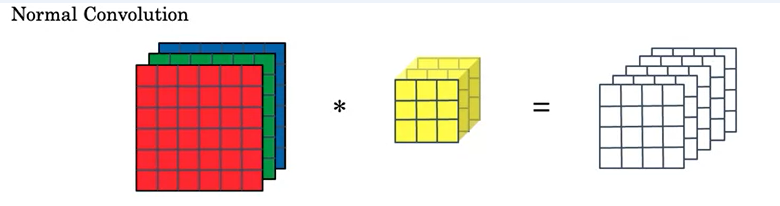

# Using Transfer Learning and MobileNet to build an Alpaca Classifier

## Explaining MobileNet

MobileNet is a convolutional neural network(CNN) architecture designed for low compute environments
e.g mobile phones or embedded systems.

The MobileNet paper: <b>MobileNets: Efficient Convolutional Neural Networks for Mobile Vision Applications</b> can be found here: https://www.researchgate.net/publication/316184205_MobileNets_Efficient_Convolutional_Neural_Networks_for_Mobile_Vision_Applications

The key aspect of MobileNet is that it uses Depthwise-Seperable Convolutions as opposed to Normal Convolutions.

Normal Convolutions can be thought of as volumetric where you multiply volumes to volumes.
