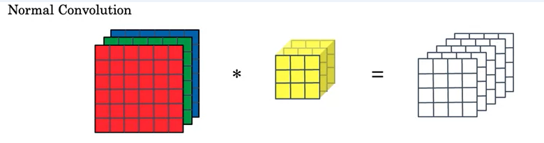
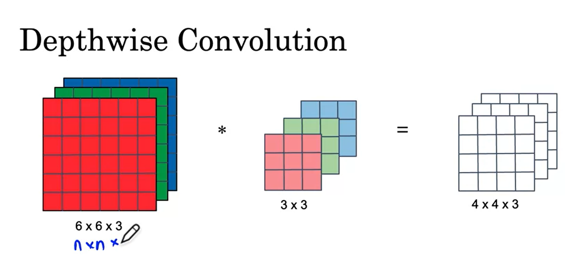
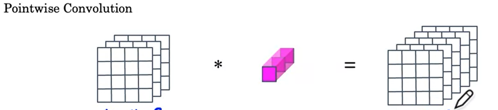
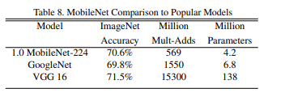
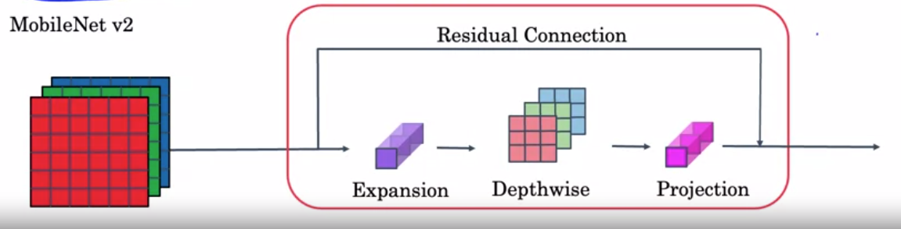

# Using Transfer Learning and MobileNet to build an Alpaca Classifier

## Explaining MobileNet

MobileNet is a convolutional neural network(CNN) architecture designed for low compute environments
e.g mobile phones or embedded systems.

The MobileNet paper: <b>MobileNets: Efficient Convolutional Neural Networks for Mobile Vision Applications</b> can be found here: https://www.researchgate.net/publication/316184205_MobileNets_Efficient_Convolutional_Neural_Networks_for_Mobile_Vision_Applications

The key aspect of MobileNet is that it uses Depthwise-Seperable Convolutions as opposed to Normal Convolutions.

Normal Convolutions can be thought of as volumetric where you multiply volumes to volumes.

 
Depthwise-Seperable Convolutions are broken into Depthwise and then seperable convolutions

### Depthwise
This involves convolutions per single channel e.g depth.
Here, e.g channel has it's own filter. Red convolved with red filter and so on..

### Seperable(Pointwise)
The output of the depthwise part is then convolved with a number of 1x1 filters. The number of filters 
is equal to desired number of channels in the final output.

## Why MobileNet works

The number of multiplications(computational cost) needed to achieve the same output as normal convolutions is significantly less when using Depthwise-Seperable convolutions.
This makes it very useful in systems which don't have a lot of computaional power.

## What about Accuracy

MobileNet does not sacrifice accuracy inorder to achieve low computational cost. Below is a table comparing
it to other popular networks such as the inception network from GoogleNet and VGG-16.
 

 
Notice how it has relatively the same accuracy while having significantly less computational cost for training.

# Introducing MobileNet v2

MobileNetV2 is a convolutional neural network architecture that seeks to perform well on mobile devices. It is based on an inverted residual structure where the residual connections are between the bottleneck layers.
Paper: https://arxiv.org/abs/1801.04381v4

## A single block
 

 
It is similar to v1 except it uses skip connections too. It also adds an expansion layer before the depthwise
convolution.
The block is also called the <b>Bottleneck Block</b>